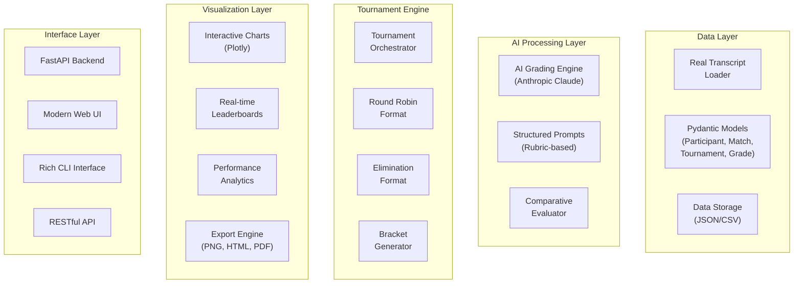

# AI Sales Evaluation Arena

[](https://www.python.org/downloads/)
[](https://opensource.org/licenses/MIT)
[](https://fastapi.tiangolo.com/)
[](https://github.com/your-repo/ai-sales-eval-arena)

> Revolutionary AI-powered tournament framework for evaluating and ranking sales pitch performances using advanced language models.

## 🚀 Overview

The AI Sales Evaluation Arena transforms sales training and evaluation by creating objective, competitive environments where AI judges evaluate sales pitches against comprehensive criteria. This system eliminates human bias while providing detailed, actionable feedback for performance improvement.

### ✨ Key Features

- **🤖 AI-Powered Evaluation**: Advanced Claude models assess sales pitches using structured rubrics
- **🏆 Tournament Formats**: Round-robin, single elimination, and double elimination tournaments
- **📊 Interactive Visualizations**: Stunning Plotly charts perfect for presentations and blog posts
- **⚡ Real-time Updates**: Live tournament progress and standings
- **🌐 Modern Web Interface**: Beautiful FastAPI-powered dashboard
- **🔄 Scalable Architecture**: Handle tournaments of any size with concurrent processing
- **📈 Comprehensive Analytics**: Performance insights and improvement recommendations

## 🏗️ Architecture



## 🛠️ Installation

### Prerequisites

- Python 3.10 or higher
- Anthropic API key
- Git

### Quick Setup

```bash
# Clone the repository
git clone https://github.com/your-repo/ai-sales-eval-arena.git
cd ai-sales-eval-arena

# Install with pip (development mode)
pip install -e .

# Or install with optional dependencies
pip install -e ".[dev]"

# Set your Anthropic API key
export ANTHROPIC_API_KEY="your-api-key-here"
```

### Alternative: Using Poetry

```bash
# Install Poetry if you haven't already
curl -sSL https://install.python-poetry.org | python3 -

# Install dependencies
poetry install

# Activate the virtual environment
poetry shell
```

## 🚀 Quick Start

### 1. Create Your First Tournament (CLI)

```bash
# Create a tournament with 8 participants
arena create-tournament \
    --name "Q4 Sales Championship" \
    --description "Quarterly sales pitch evaluation" \
    --format round_robin \
    --participants 8 \
    --output-dir results/

# Load sample transcript data
arena generate-data --count 10 --format json

# Run benchmarks
arena benchmark --count 3 --participants 6

# Get system info
arena info
```

### 2. Launch the Web Interface

```bash
# Start the web application
uvicorn ai_sales_eval_arena.web_app:app --reload --host 0.0.0.0 --port 8000

# Visit http://localhost:8000 in your browser
```

### 3. Programmatic Usage

```python
import asyncio
from ai_sales_eval_arena.tournament import TournamentManager
from ai_sales_eval_arena.transcript_loader import create_sample_data
from ai_sales_eval_arena.models import TournamentFormat, ArenaConfig

async def run_tournament():
    # Configure the arena
    config = ArenaConfig(anthropic_api_key="your-key-here")
    
    # Load real transcript data
    participants, transcripts = create_sample_data(num_participants=6)
    
    # Create and run tournament
    manager = TournamentManager(config)
    tournament = await manager.create_and_run_tournament(
        name="Demo Tournament",
        participants=participants,
        transcripts=transcripts,
        tournament_format=TournamentFormat.ROUND_ROBIN
    )
    
    # Display results
    for standing in tournament.standings:
        participant = next(p for p in participants if p.id == standing.participant_id)
        print(f"{standing.rank}. {participant.name}: {standing.wins} wins")

# Run the tournament
asyncio.run(run_tournament())
```

## 📊 Evaluation Criteria

The AI evaluates sales pitches against five key criteria:

### 1. ICP Alignment (Ideal Customer Profile)
- **Excellent (4)**: 75%+ ICP criteria met with specific examples
- **Very Good (3)**: 50-74% ICP criteria met with clear explanations  
- **Good (2)**: 25-49% ICP criteria met with basic explanations
- **Needs Improvement (1)**: 0-24% ICP criteria met

### 2. PBO Messaging Alignment (Positive Business Outcomes)
- Clear connection between features and business value
- Quantified impact statements
- Relevance to target personas

### 3. Continuous Profiling Explanation
- Technical accuracy and clarity
- Appropriate depth for audience
- Concrete examples and benefits

### 4. Observability Context
- Integration with monitoring ecosystem
- Understanding of metrics, logs, and traces
- Complementary tool positioning

### 5. Talk Track Alignment
- Natural flow and delivery
- Research integration
- Proactive objection handling

## 📂 Using Real Transcripts

The system loads sales pitch transcripts from text files in the `data/transcripts/` directory:

### File Structure
```
data/
└── transcripts/
    ├── maya_magnificent.txt
    ├── gary_garbage.txt
    ├── betty_benchmark.txt
    └── ...
```

### Transcript Format
- **File naming**: `firstname_lastname.txt` (e.g., `john_doe.txt`)
- **Content**: Plain text sales pitch transcript
- **Quality inference**: Skill levels are automatically inferred from filenames
- **Participant creation**: Names are extracted from filenames (e.g., "John Doe")

### Quality Categories
The system includes 50 sample transcripts with varying quality levels:
- **Expert level**: Names like `maxwell_profiler`, `maya_magnificent`, `stella_stacktrace`
- **Intermediate level**: Most other professional-sounding names
- **Beginner level**: Names like `gary_garbage`, `derek_disaster`, `nancy_nonsense`

### Custom Transcripts
To use your own transcripts:
1. Place `.txt` files in `data/transcripts/` directory
2. Use `firstname_lastname.txt` naming convention
3. Ensure files contain the actual sales pitch content
4. Run tournaments using the transcript loader

## 🎨 Visualization Examples

The system generates publication-ready visualizations:

### Interactive Leaderboard
```python
from ai_sales_eval_arena.visualization import TournamentVisualizer

visualizer = TournamentVisualizer(config)
fig = visualizer.create_leaderboard_chart(tournament)
fig.show()  # Interactive Plotly chart
```

### Performance Radar Chart
```python
radar_fig = visualizer.create_performance_radar_chart(tournament)
radar_fig.write_html("performance_analysis.html")
```

### Export for Blog Posts
```python
from ai_sales_eval_arena.visualization import VisualizationExporter

blog_files = VisualizationExporter.create_blog_ready_exports(
    tournament, 
    output_dir="blog_assets/",
    config=viz_config
)
```

## 🔧 Configuration

### Environment Variables

```bash
# Required
export ANTHROPIC_API_KEY="your-anthropic-api-key"

# Optional
export ARENA_ANTHROPIC_MODEL="claude-3-5-sonnet-20241022"
export ARENA_MAX_CONCURRENT_MATCHES="5"
export ARENA_GRADING_TIMEOUT_SECONDS="60"
export ARENA_DATA_DIRECTORY="data"
export ARENA_RESULTS_DIRECTORY="results"
```

### Configuration File

```json
{
    "anthropic_api_key": "your-key-here",
    "anthropic_model": "claude-3-5-sonnet-20241022",
    "max_concurrent_matches": 5,
    "grading_timeout_seconds": 60,
    "visualization": {
        "title": "Custom Tournament",
        "theme": "plotly_white",
        "width": 1200,
        "height": 800,
        "export_formats": ["html", "png", "pdf"]
    }
}
```

## 🧪 Testing

The project includes comprehensive test coverage:

```bash
# Run all tests
pytest

# Run with coverage
pytest --cov=ai_sales_eval_arena --cov-report=html

# Run specific test categories
pytest -m unit          # Unit tests only
pytest -m integration   # Integration tests only
pytest -m slow          # Long-running tests

# Run tests in parallel
pytest -n auto
```

### Test Categories

- **Unit Tests**: Models, transcript loading, utilities
- **Integration Tests**: End-to-end tournament workflows
- **Performance Tests**: Benchmarking and load testing
- **API Tests**: FastAPI endpoint validation

## 🌐 API Reference

### REST Endpoints

```
GET    /                           # Home page
GET    /tournament/{id}            # Tournament details
POST   /api/tournaments            # Create tournament
GET    /api/tournaments            # List tournaments
GET    /api/tournaments/{id}/standings  # Get standings
GET    /api/tournaments/{id}/visualizations/{type}  # Get charts
```

### Example API Usage

```python
import httpx

# Create a tournament via API
tournament_data = {
    "name": "API Tournament",
    "format": "round_robin",
    "num_participants": 6,
    "use_sample_data": True
}

response = httpx.post("http://localhost:8000/api/tournaments", json=tournament_data)
tournament = response.json()

# Get live standings
standings = httpx.get(f"http://localhost:8000/api/tournaments/{tournament['id']}/standings")
```

## 📈 Performance

The system is designed for scale:

- **Concurrent Processing**: Multiple matches evaluated simultaneously
- **Efficient AI Usage**: Optimized prompts and structured outputs
- **Memory Management**: Streaming data processing for large tournaments
- **Rate Limiting**: Respects Anthropic API limits

### Benchmark Results

| Participants | Matches | Duration | Matches/sec |
|-------------|---------|----------|-------------|
| 6           | 15      | 45s      | 0.33        |
| 8           | 28      | 78s      | 0.36        |
| 10          | 45      | 125s     | 0.36        |

## 🤝 Contributing

We welcome contributions! Here's how to get started:

1. **Fork the repository**
2. **Create a feature branch**: `git checkout -b feature/amazing-feature`
3. **Make your changes** with tests
4. **Run the test suite**: `pytest`
5. **Submit a pull request**

### Development Setup

```bash
# Install development dependencies
pip install -e ".[dev]"

# Set up pre-commit hooks
pre-commit install

# Run formatting and linting
black .
isort .
flake8 .
mypy .
```

## 📝 License

This project is licensed under the MIT License - see the [LICENSE](LICENSE) file for details.

## 🙏 Acknowledgments

- **Anthropic** for providing the Claude models that power the evaluation engine
- **Plotly** for the stunning interactive visualizations
- **FastAPI** for the modern web framework
- **Pydantic** for robust data validation
- **The Sales Community** for inspiration and feedback

## 🔗 Links

- [Documentation](https://your-docs-site.com)
- [API Reference](https://your-api-docs.com)
- [Blog Post](https://your-blog.com/ai-sales-arena)
- [GitHub Issues](https://github.com/your-repo/ai-sales-eval-arena/issues)
- [Discussions](https://github.com/your-repo/ai-sales-eval-arena/discussions)

---

**Ready to revolutionize your sales training?** 🚀

[Get Started Now](https://github.com/your-repo/ai-sales-eval-arena) | [View Demo](https://demo.your-site.com) | [Read the Blog Post](https://your-blog.com/ai-sales-arena) 